# Trip Backend

## 주요 기능
- 회원 관리: 회원가입, 로그인, 비밀번호 찾기, 정보 수정/탈퇴, remember-me 쿠키 처리
- 여행 일정: `plan.jsp` UI와 `/plan` API를 통한 일정 저장 및 목록 조회(JSON)
- 지역 데이터 API: `/api` 엔드포인트로 시·군·구 및 관광지 검색
- 지도/미디어 뷰: Kakao 지도 연동 `map.jsp`
- 요청 수명주기 보조: `LoggingFilter`, `MyContextListener`

## 기술 스택
- Language: Java 17
- Runtime: Jakarta Servlet 6.0, JSP 4.0, JSTL 3.0
- Build: Maven (`pom.xml`), WAR 패키징
- Database: MySQL 8 (기본 URL `jdbc:mysql://localhost:3306/ssafy_trip`)

**데이터베이스 설정**
- DB 계정과 스키마를 준비해 주세요.
- `ssafy_trip` 스키마를 생성하고 사용자 권한을 부여합니다.
- 필요하면 `src/main/java/com/ssafy/exam/util/DBUtil.java`의 `URL`, `USER`, `PASSWORD` 값을 환경에 맞춰 수정합니다.

## 서비스 화면
- **서비스화면**  
  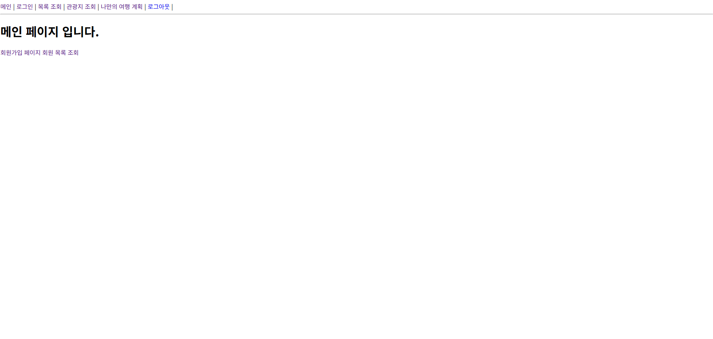
- **로그인페이지**  
  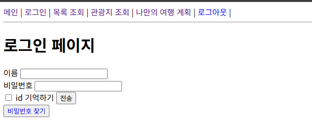
- **회원가입**  
  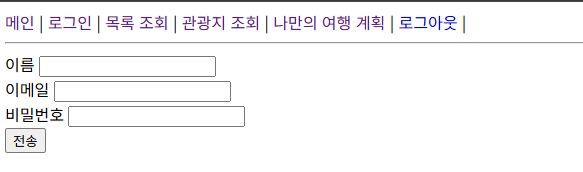
- **관리자로그인**  
  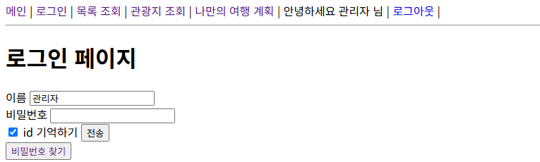
- **로그아웃 및 쿠키 처리**  
  
- **비밀번호 찾기**  
  
- **회원 목록 조회**  
  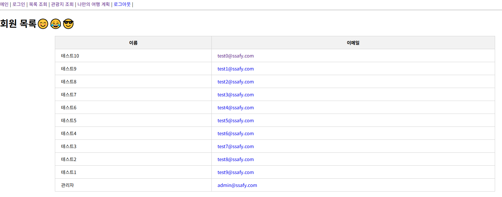
- **멤버 DB**  
  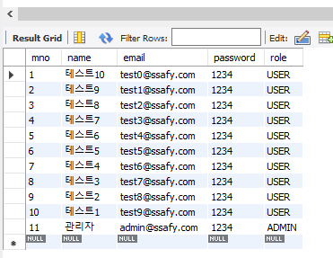

## 서비스 조회 화면
- **관광지 조회**  
  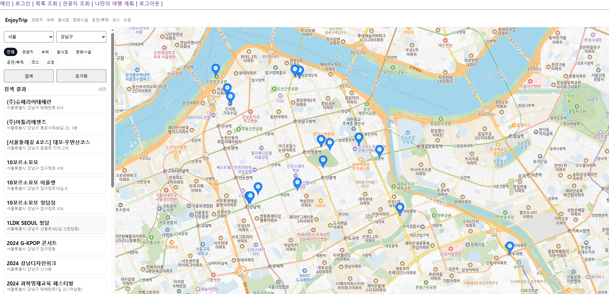
- **나만의 여행 계획**  
  
- **여행 계획 저장**  
  
- **여행 계획 DB**  
  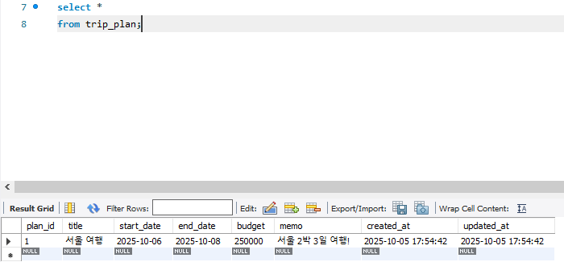
- **여행 계획 정보 DB**  
  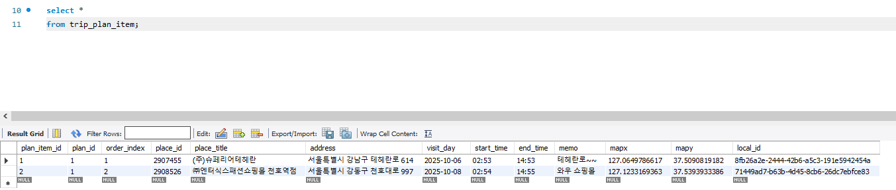

## Usecase

- **기본관리**

  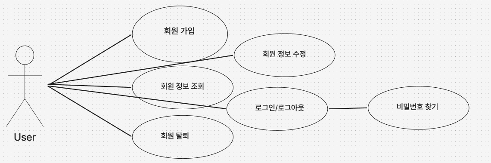

- **관광지조회**

  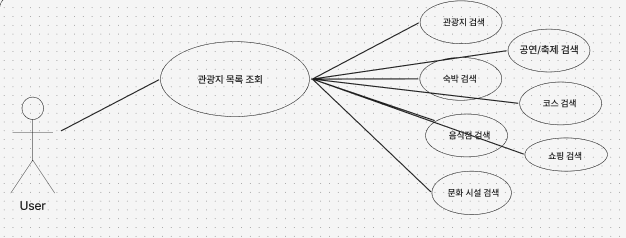

- **여행계획**
  
  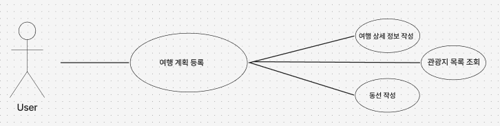

## 클래스 다이어그램

- **Class UML**

   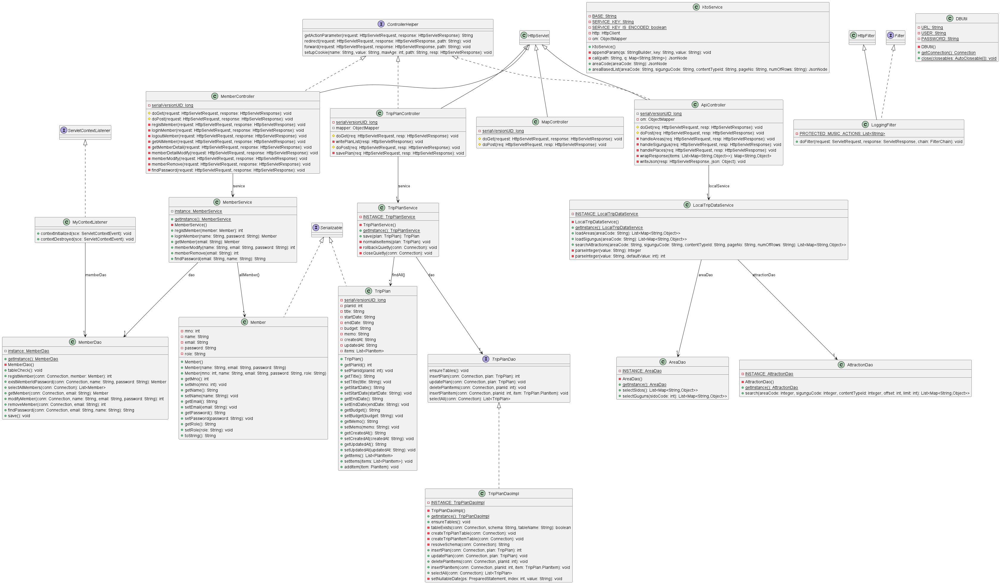

## ERD

- **ERD**

  

- **Users**: 서비스에 가입한 사용자 계정 정보를 관리하는 기본 테이블입니다.
- **Region**: 여행/관광지가 속한 지역 정보를 관리하고, 자기참조로 시·군·구 같은 계층 구조를 표현합니다.
- **POI**: 관광지(명소)의 이름, 설명, 주소, 좌표, 썸네일과 어느 지역에 속하는지 저장하는 테이블입니다.
- **Trip**: 여행 제목, 기간, 설명, 지역, 호스트, 최대 인원 등 하나의 “여행 방(여행 일정)” 정보를 담는 핵심 엔티티입니다.
- **Chat_Room**: 각 여행계획에 1:1로 매핑되는 채팅방 정보를 저장해, 여행별 채팅 공간을 구분합니다.
- **Trip_Participant**: 어떤 사용자가 어떤 여행에 참가했는지 M:N 관계를 풀어주는 참가자 매핑 테이블입니다.
- **Chat_Message**: 채팅방에서 누가, 언제, 어떤 내용을 보냈는지 메시지 단위로 기록하는 로그 테이블입니다.

---

## 프로젝트 현대화 마이그레이션 요약

이 프로젝트는 기존의 전통적인 서블릿/JSP/JDBC 구조에서 최신 Spring Boot 기반 아키텍처로 성공적으로 마이그레이션되었습니다.

### 주요 변경 사항

1.  **Spring Boot 전환**:
    *   **빌드 시스템**: `pom.xml`을 Spring Boot Starter 의존성을 사용하도록 업데이트하여 구성을 간소화하고, 실행 가능한 `.jar` 파일로 빌드되도록 변경했습니다.
    *   **내장 서버**: 이제 별도의 Tomcat 서버 없이 `main` 메소드를 실행하여 내장된 서버로 애플리케이션을 구동할 수 있습니다.

2.  **백엔드 리팩토링**:
    *   **Controller**: 모든 서블릿(`HttpServlet`)을 Spring MVC의 `@Controller` 및 `@RestController`로 전환했습니다.
    *   **Service**: 모든 서비스 클래스를 `@Service` 어노테이션을 사용하여 Spring의 트랜잭션 관리 기능(`@Transactional`)을 적용했습니다.
    *   **Data Access Layer**: 기존의 수동 JDBC 코드를 모두 제거하고, `MyBatis`를 도입하여 DAO 인터페이스와 Mapper XML로 데이터를 처리하도록 변경했습니다.

3.  **설정 및 구조 변경**:
    *   **설정 간소화**: `web.xml`, Java 기반 설정 파일 등 복잡한 설정들을 제거하고, `application.properties` 파일로 설정을 통합했습니다.
    *   **프로젝트 구조**: Spring Boot 표준에 맞게 JSP 파일과 정적 리소스(CSS, JS) 파일들을 `src/main/resources` 폴더 하위로 재배치했습니다.

4.  **버그 수정 및 개선**:
    *   **URL 경로 수정**: 모든 JSP 페이지의 링크를 RESTful URL 형식으로 수정했습니다

5.  **API 명세서 작성**:
    *   **노션 링크**: https://www.notion.so/2b2af5125192800fad5acf5bab04a860

