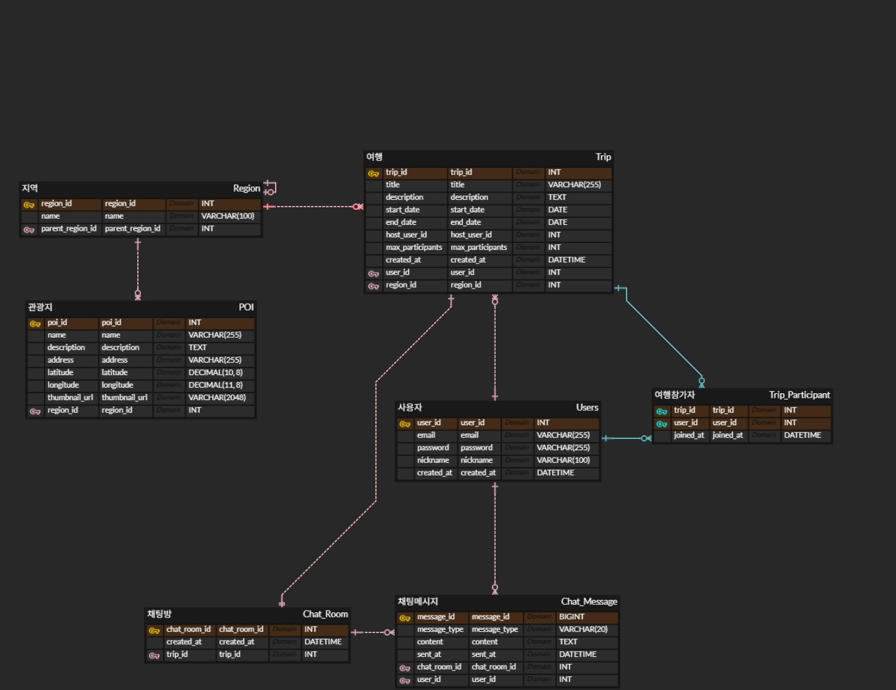

# Trip Backend

## 기술 스택

- Language: Java 17
- Runtime: Jakarta Servlet 6.0, JSP 4.0, JSTL 3.0
- Build: Maven (`pom.xml`), WAR 패키징
- Database: MySQL 8 (기본 URL `jdbc:mysql://localhost:3306/ssafy_trip`)

**데이터베이스 및 환경 설정**

- DB 계정과 스키마를 준비해 주세요.
- `ssafy_trip` 스키마를 생성하고 사용자 권한을 부여합니다.
- application.properties 설정
- TourAPI 인증키 
- tour.api.key="여기에 키 입력" (인코딩 키)
- KorService2
- tour.api.baseUrl=https://apis.data.go.kr/B551011/KorService2
- 이후 데이터 수집 실행 메서드  http://localhost:8080/admin/users/load-data 실행
#

## ERD

- **ERD**

  

- **Users**: 서비스에 가입한 사용자 계정 정보를 관리하는 기본 테이블입니다.
- **Region**: 여행/관광지가 속한 지역 정보를 관리하고, 자기참조로 시·군·구 같은 계층 구조를 표현합니다.
- **POI**: 관광지(명소)의 이름, 설명, 주소, 좌표, 썸네일과 어느 지역에 속하는지 저장하는 테이블입니다.
- **Trip**: 여행 제목, 기간, 설명, 지역, 호스트, 최대 인원 등 하나의 “여행 방(여행 일정)” 정보를 담는 핵심 엔티티입니다.
- **Chat_Room**: 각 여행계획에 1:1로 매핑되는 채팅방 정보를 저장해, 여행별 채팅 공간을 구분합니다.
- **Trip_Participant**: 어떤 사용자가 어떤 여행에 참가했는지 M:N 관계를 풀어주는 참가자 매핑 테이블입니다.
- **Chat_Message**: 채팅방에서 누가, 언제, 어떤 내용을 보냈는지 메시지 단위로 기록하는 로그 테이블입니다.

5.  **API 명세서 작성**:
    - **노션 링크**: https://www.notion.so/2b2af5125192800fad5acf5bab04a860

### 11월 28일 주요 변경 사항

1. 기능

랜딩 페이지: 시작하기 버튼으로 대시보드 진입.

지도(Map): 카카오맵 연동, 검색 시 이동(moveCamera).

검색: 가짜 데이터 검색 -> 리스트 출력 -> [추가] 버튼 시 모달 오픈.

일정 추가: 모달에서 날짜/시간 선택 -> Pinia Store 저장 -> 자동 정렬.

일정 관리: 드래그 앤 드롭으로 순서 변경, 삭제 기능.

권한: 수정 권한 요청/완료 로직 (UI 제어).

구조 (Pinia 도입 완료):

tripStore.js가 중앙 관제탑 역할을 하며 데이터(itinerary)를 잡고 있습니다.

PlanningDashboard.vue(입력)와 ItineraryList.vue(출력)는 서로 직접 대화하지 않고 Store를 통해서만 소통합니다.

Front-end 작성 중 입니다. 기존의 front는 사용하지 않을 예정입니다.

해당 결과물은 현재 gitaek-anolja-front.zip 에 담겨있습니다.

### 12월 1일 ~ 12월 5일 백엔드_로그인_관련 주요 변경 사항

1. 기능 (Feature)

회원가입, 로그인 (아이디 기억하기 구현.), 내 정보 조회, 로그아웃, 비밀번호 관리 찾기, 임시 비밀번호 발급 및 변경

2. 구조 및 기술 (Structure & Tech)

RESTful API 리팩토링: 기존 '/api/user/signup' 등의 URL을 자원 중심의 '/api/users' (복수형) 및 HTTP Method('POST', 'PUT')로 전면 재설계.

DTO 패턴 도입 (Security): 'UserDto' 하나로 통일하지 않고, 'UserLoginRequest', 'UserSignupRequest' 등으로 클래스를 세분화하여 오버포스팅 방지 및 보안 강화.
-> 이유: 로그인이나 가입마다 필요한 데이터와 검증 규칙이 다른데, 하나로 몽뚤그리면 불필요한 데이터 노출로 인해 해킹 위험이 생길 수도 있고,  코드 수정시 범용성을 고려하여 유지보수를 위함.

model폴더 내 User를  따로 둚.
-> 이유: Model은 DB 테이블과 100% 똑같은 '원본'이라 함부로 건드리면 안 되고, DTO는 화면 요구사항에 따라 막 변해도 되는 포장지 역할을 하기에 분리함.

CORS 설정: Vue.js 연동을 대비하여 'WebMvcConfig' 도입.

3. 테스트 및 현황 (Status)

Postman 설치 이슈 대안으로(박기택 노트북에 윈도우 버전이 안맞아서 설치가 안 됨) 'static/index.html' 및 Talend API Tester 자체 테스트 페이지 구축 완료.

[가입] → [로그인] → [세션 확인] → [비번 변경] → [로그아웃]으로 이어지는 전체 시나리오 테스트 통과 (100% 완료).

4. Vue.js와 최초 연결 성공

: 기존 작업자의 컴퓨터에서 포트번호가 달라서 오류가 떴었으나 이후 포트번호만 'resoureces/application.properties'에서 변경하니 오류없이 로그인, 회원가입, 로그아웃 등 동작 정상작동 확인. 

5. 금일 업데이트 이후, 추가하거나, 수정해야 할 부분 고민

: 현재 최우선 순위인 구현에 초점을 맞추느라, 뷰와 연동성 문제에 대해서 성공을 했지만, 보안 관련해서는 취약하다. 여행 기능을 추가할지, 아니면 로그인 보안 기능을 좀 더 추가할지에 대해 우선순위적으로 판단하는게 맞다고 생각되지만, 우리의 코드와 메이저 로그인 기능 관련 코드(네이버,카카오 등)에 대해 비교 분석해 보았고, Spring Security, 유효성 검증 등 나아가야 할 방향성을 노션 프로젝트/로그인/ 1205에 정리해보았다. 

### 12월 9일 주요 변경 사항: 관리자 백엔드 기능 생성

1. DB 및 초기 데이터 세팅 (SQL)
2. Model.java에도 자바 객체 맞추기: role 추가
- 이유
    1. MyBatis가 DB에서 role을 가져왔을 때 담을 그릇이  User.java라서 꼭 필요
    2. User.java는 DB 테이블의 복사본이라서, DB가 바뀌면 얘도 무조건 바뀜.
    3. 다른 DTO들은 “이 정보가 필요한가?"를 따져보고 필요할 때만 추가하면 됨. 
3. Mapper XML 수정 (UserMapper.xml)
- 확인
    
    countUserList (숫자 세기): 검색 결과 총 몇 명인지 확인하는 것.
    
    selectUserList(명단 가져오기): 페이지에 보여줄 10명 데이터 가져오기. → 단, 회원수가 많아지면 다른 식으로 관리할 필요가 있지만, 우선순위가 아니기에 굳이 안고쳐도 될 듯. 
    
    updateUserRole(권한부여)
    
    - 권한 종류
        
        role에 “BANNED”를 넣으면 → 정지 기능
        
        role에  “USER”를 넣으면 → 정지 해제 기능
        
        role에  “ADMIN’을 넣으면 → 관리자 승격 기능
        
4. Mapper Interface 수정(UserMapper.java): 관리자용 메서드 추가
5. Service 구현(UserService.java)
- 로직
    1. 회원목록조회
    2. 권한변경
    3. 회원 비밀번호 강제 1234 초기화 ← 차후 보안성 강화 필요.
6. Controller 구현(AdminController.java): 코드가 너무 길어져서 새 파일을 만듦.

→ 아이디는 admin 비밀번호는 1234 로그인

[핵심정리]

1. 관리자 권한 리스트: 전체회원조회검색, 회원상태변경(악성유저 정지, 정지유저 해체, 부관리자 승격), 비밀번호 1234 초기화
2. AdminController따로 뺀 이유: 보안상 관리가 쉬움 - 인터셉터 처리, 역할의 분리(SRP원칙) 등